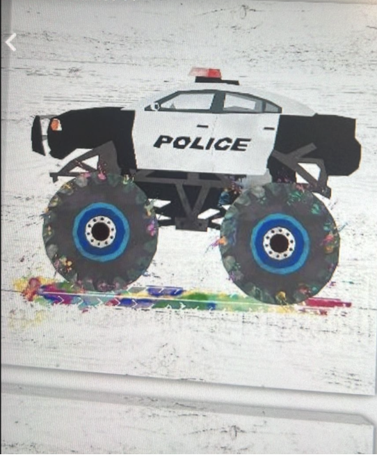
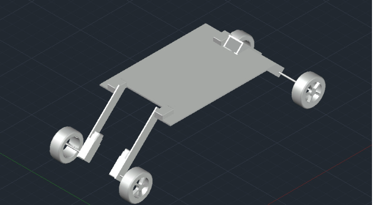
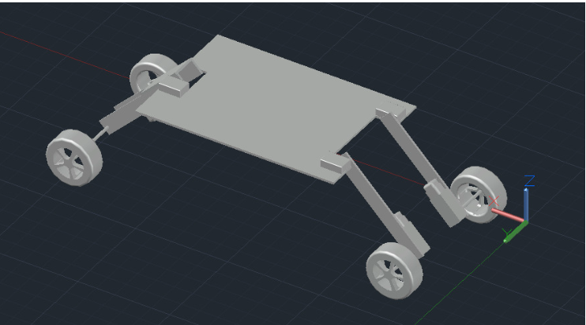
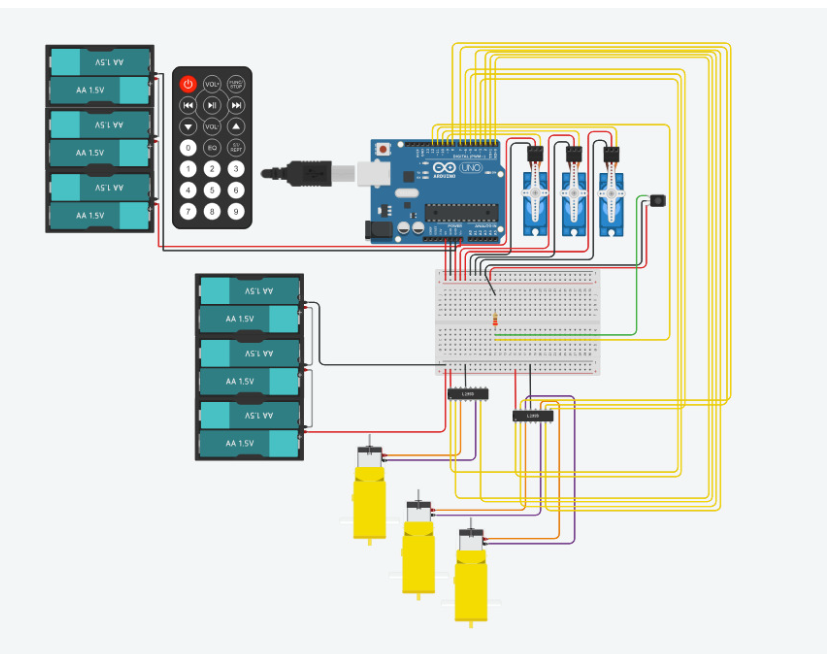
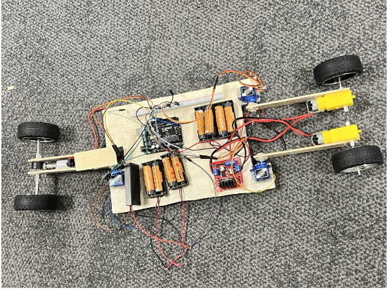
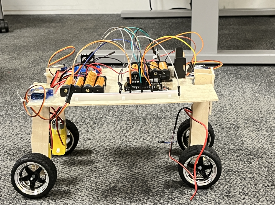
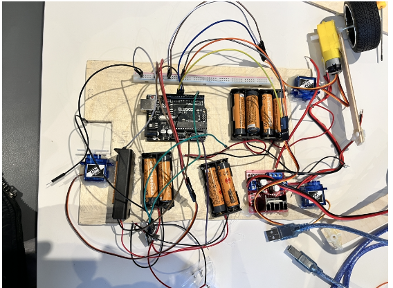

# apollo-chariot-offroad-rescue-vehicle
## Introduction

Mobility in rough and extreme terrains presents significant challenges for conventional vehicles. Environments such as rocky landscapes, muddy areas, and disaster zones require specialised vehicles capable of navigating obstacles while maintaining stability.

Apollo’s Chariot is an off-road rescue vehicle prototype designed to overcome terrain limitations through adaptive mechanical design and embedded control systems. The system integrates mechanical structure, microcontroller-based control, and servo-driven articulation to allow the vehicle to adjust its height and maintain stability across uneven terrain.

The vehicle prototype demonstrates how low-cost electronics and mechanical design can be combined to create a terrain-adaptive rescue platform capable of supporting disaster relief operations, mining safety missions, and emergency transportation.
## Need Statement

Apollo’s Chariot was designed as a remote-controlled, height-adjustable off-road vehicle capable of navigating difficult terrain conditions while maintaining stability.

The goal of the project was to create a lightweight but durable vehicle platform that integrates:

- Servo-controlled steering
- Adjustable ground clearance
- Obstacle detection capability
- Remote or autonomous control
- Modular electronic control system
The design focuses on improving mobility in environments where conventional vehicles cannot operate efficiently, such as disaster zones, mining operations, or uneven terrain.
## Design Requirements

The system was designed to meet the following requirements:

### Steering Operation
Servo motors are used to control steering and articulation of the vehicle.

### Remote Operation
The vehicle was initially designed to be remotely controlled using an infrared remote system.

### Obstacle Detection
IR sensors were included to detect obstacles and allow smooth transitions between vehicle angles.

### Structural Design

**Base frame size**
10 cm × 20 cm

**Motor and wheel layout**
10 cm × 10 cm footprint

### Height Adjustment

The vehicle adjusts its ground clearance using servo motors that modify the angles of the supporting arms.

Initial servo angles:

Servo 1: 170°  
Servo 2: 20°  
Servo 3: 7°

Adjusted servo angles:

Servo 1: 135°  
Servo 2: 45°  
Servo 3: 45°
## Design Concepts

During the early stages of the project several vehicle concepts were explored.

### Transformer Concept
A transformer-style vehicle capable of changing shape was initially considered. This design would allow the chassis and wheels to expand or contract dynamically.

### Low-Rider Concept
Inspired by low-rider vehicles with adjustable suspension systems, this concept focused on changing vehicle height to adapt to terrain conditions.

### Police Rescue Vehicle
A police rescue themed vehicle with enhanced mobility was proposed by the design team.

After evaluating complexity, feasibility, and available resources, the team selected a simplified adaptive rescue vehicle design named **Apollo’s Chariot**.
## Final Design Selection

Apollo’s Chariot was selected as the final concept because it balanced innovation with practicality. The design allowed the team to focus on key engineering components such as:

- Servo-based height adjustment
- Remote or automated control
- Terrain adaptability
- Low-cost prototype manufacturing

The project also provided hands-on experience in electronics integration, microcontroller programming, mechanical design, and collaborative engineering.
## Initial Concept



The early design stage involved hand-drawn sketches to visualize the vehicle structure and articulation mechanism.
## Design Calculations

Key mechanical dimensions of the prototype are listed below.

Vehicle dimensions:

Length: 27 cm  
Width: 18 cm  

Component layout:

Distance from servo joint to wheel: 13 cm  
Distance between wheels: 12 cm  

Leg structure:

Leg length: 15 cm  
Leg widths: 2 cm and 3 cm  

Wheel dimensions:

Wheel width: 2.5 cm  
Wheel diameter: 5 cm  
Tyre diameter: 6.5 cm  
## CAD Design



CAD models were developed to determine chassis geometry, wheel placement, and structural balance.
Material:

Chassis material: 3 mm plywood
## Materials Selection

Materials were selected based on durability, weight, availability, and cost.

### Chassis
Plywood was used because it is lightweight, affordable, and easy to cut while still providing sufficient structural strength.

### Wheels and Tyres
Off-road tyres were used to improve traction on uneven surfaces.
## Height Adjustment Mechanism



Servo motors control the angle of the supporting arms, allowing the vehicle to adjust its ground clearance depending on terrain conditions.

### Electronic Components

Main electronics used in the system include:

- Arduino UNO microcontroller
- L298N motor driver
- SG90 servo motors
- DC motors
- infrared sensor module
  ## Electronics Architecture



The electronics system uses an Arduino UNO microcontroller to control motors and servos. The circuit was first simulated in Tinkercad before building the physical prototype.
  ## Budget

The allocated budget for the project was £130.

The final build cost was approximately:

£126
## Microcontroller and Circuit System

The vehicle uses an Arduino UNO as the central controller. The Arduino manages motor drivers, servo motors, and sensor inputs.

Three servo motors control steering and height adjustment, while DC motors drive the wheels.

Motor drivers are used to control direction and speed using PWM signals from the Arduino.
## Prototype Assembly



The prototype integrates the mechanical chassis, motors, servos, and microcontroller into a compact rescue vehicle platform.
  Arduino Code:
## Arduino Control Code

#include <Servo.h>

// Motor enable pins
#define EN1 5
#define EN2 6
#define EN3 9

// Motor direction pins
#define IN1 2
#define IN2 4
#define IN3 7
#define IN4 8
#define IN5 13
#define IN6 12

Servo servo1;
Servo servo2;
Servo servo3;

// Smooth servo movement function
void sweepServo(Servo &servo, int startAngle, int endAngle, int stepDelay) {

  if (startAngle < endAngle) {
    for (int pos = startAngle; pos <= endAngle; pos++) {
      servo.write(pos);
      delay(stepDelay);
    }
  } else {
    for (int pos = startAngle; pos >= endAngle; pos--) {
      servo.write(pos);
      delay(stepDelay);
    }
  }
}

void setup() {

  servo1.attach(3);
  servo2.attach(10);
  servo3.attach(11);

  pinMode(EN1, OUTPUT);
  pinMode(IN1, OUTPUT);
  pinMode(IN2, OUTPUT);

  pinMode(EN2, OUTPUT);
  pinMode(IN3, OUTPUT);
  pinMode(IN4, OUTPUT);

  pinMode(EN3, OUTPUT);
  pinMode(IN5, OUTPUT);
  pinMode(IN6, OUTPUT);

  Serial.begin(9600);
}

void loop() {

  // Initial servo positions
  servo1.write(170);
  servo2.write(20);
  servo3.write(7);

  delay(1000);

  // Move forward
  digitalWrite(IN1, HIGH);
  digitalWrite(IN2, LOW);

  digitalWrite(IN3, HIGH);
  digitalWrite(IN4, LOW);

  digitalWrite(IN5, LOW);
  digitalWrite(IN6, HIGH);

  analogWrite(EN1, 80);
  analogWrite(EN2, 80);
  analogWrite(EN3, 255);

  delay(5000);

  // Stop motors
  analogWrite(EN1, 0);
  analogWrite(EN2, 0);
  analogWrite(EN3, 0);

  delay(1000);

  // Servo movement
  sweepServo(servo1, 180, 135, 10);
  sweepServo(servo2, 10, 45, 10);
  sweepServo(servo3, 7, 45, 10);

  // Move backward
  digitalWrite(IN1, LOW);
  digitalWrite(IN2, HIGH);

  digitalWrite(IN3, LOW);
  digitalWrite(IN4, HIGH);

  digitalWrite(IN5, HIGH);
  digitalWrite(IN6, LOW);

  analogWrite(EN1, 80);
  analogWrite(EN2, 80);
  analogWrite(EN3, 255);

  delay(5000);

  // Stop motors
  analogWrite(EN1, 0);
  analogWrite(EN2, 0);
  analogWrite(EN3, 0);

  delay(1000);
}

## Adjustable Leg Mechanism



Servo-mounted legs allow the vehicle to modify its height and improve stability on uneven surfaces.
## Future Improvements

Several improvements could be implemented in future versions of the vehicle.

• Using Arduino Mega for additional I/O pins  
• Stronger servo motors for improved load capacity  
• Radio-frequency remote control instead of infrared  
• Ultrasonic sensors for obstacle detection  
• Wireless camera module for remote rescue missions
## Electronics Integration



The electronics section includes the Arduino controller, motor drivers, power supply, and wiring for motors and servos.
## Arduino Control System

The vehicle is controlled using an Arduino program that manages motor direction, speed, and servo articulation.

The system performs the following sequence:

1. Initialize servo positions
2. Move vehicle forward
3. Stop motors
4. Adjust servo angles
5. Move vehicle backward
6. Repeat movement sequence
## Skills Demonstrated

Mechanical Design  
Embedded Systems Programming  
Arduino Development  
Electronics Integration  
CAD Modelling  
Rapid Prototyping  
Engineering Project Management
## Arduino Control Code

#include <Servo.h>

// Motor enable pins
#define EN1 5
#define EN2 6
#define EN3 9

// Motor direction pins
#define IN1 2
#define IN2 4
#define IN3 7
#define IN4 8
#define IN5 13
#define IN6 12

Servo servo1;
Servo servo2;
Servo servo3;

void sweepServo(Servo &servo, int startAngle, int endAngle, int stepDelay) {

  if (startAngle < endAngle) {
    for (int pos = startAngle; pos <= endAngle; pos++) {
      servo.write(pos);
      delay(stepDelay);
    }
  } 
  else {
    for (int pos = startAngle; pos >= endAngle; pos--) {
      servo.write(pos);
      delay(stepDelay);
    }
  }
}

void setup() {

  servo1.attach(3);
  servo2.attach(10);
  servo3.attach(11);

  pinMode(EN1, OUTPUT);
  pinMode(IN1, OUTPUT);
  pinMode(IN2, OUTPUT);

  pinMode(EN2, OUTPUT);
  pinMode(IN3, OUTPUT);
  pinMode(IN4, OUTPUT);

  pinMode(EN3, OUTPUT);
  pinMode(IN5, OUTPUT);
  pinMode(IN6, OUTPUT);

  Serial.begin(9600);
}

void loop() {

  servo1.write(170);
  servo2.write(20);
  servo3.write(7);

  delay(1000);

  digitalWrite(IN1, HIGH);
  digitalWrite(IN2, LOW);

  digitalWrite(IN3, HIGH);
  digitalWrite(IN4, LOW);

  digitalWrite(IN5, LOW);
  digitalWrite(IN6, HIGH);

  analogWrite(EN1, 80);
  analogWrite(EN2, 80);
  analogWrite(EN3, 255);

  delay(5000);

  analogWrite(EN1, 0);
  analogWrite(EN2, 0);
  analogWrite(EN3, 0);

  delay(1000);

  sweepServo(servo1, 180, 135, 10);
  sweepServo(servo2, 10, 45, 10);
  sweepServo(servo3, 7, 45, 10);

  digitalWrite(IN1, LOW);
  digitalWrite(IN2, HIGH);

  digitalWrite(IN3, LOW);
  digitalWrite(IN4, HIGH);

  digitalWrite(IN5, HIGH);
  digitalWrite(IN6, LOW);

  analogWrite(EN1, 80);
  analogWrite(EN2, 80);
  analogWrite(EN3, 255);

  delay(5000);

  analogWrite(EN1, 0);
  analogWrite(EN2, 0);
  analogWrite(EN3, 0);

  delay(1000);
}
```
